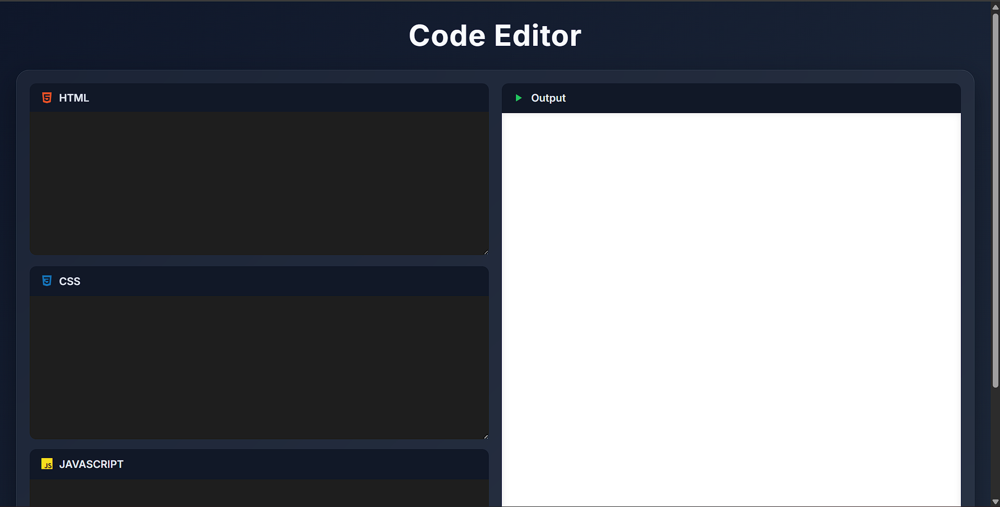
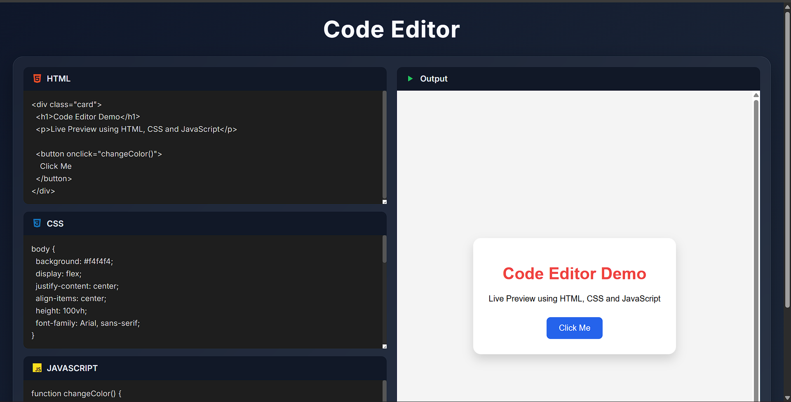

# WebLab 🧪

A browser-based **Live Code Editor** built using **HTML, CSS, and JavaScript**. WebLab allows users to write, style, and execute code in real time while instantly previewing the output, making it a lightweight playground for front-end experimentation and learning.

## 🚀 Features

- Live HTML editing and rendering
- Real-time CSS styling updates
- Instant JavaScript execution
- Interactive output preview using iframe
- Clean and responsive user interface
- Separate editors for HTML, CSS, and JavaScript
- Beginner-friendly project structure

## 🛠️ Technologies Used

- HTML5
- CSS3
- JavaScript (ES6)
- DOM Manipulation
- iframe

## 🎯 How It Works

1. Enter HTML code in the HTML editor.
2. Add CSS styles in the CSS editor.
3. Write JavaScript code in the JavaScript editor.
4. The application automatically updates the preview whenever you type.
5. HTML and CSS are injected into an iframe.
6. JavaScript is executed inside the iframe.
7. The rendered output is displayed instantly.

## 📸 Preview

### Initial Screen



### Live Preview



## 📂 Project Structure

```text
WebLab/
│
├── screenshots/
│   ├── CodePen-Initial-Screen.png
│   └── CodePen-Working.png
│
├── index.html
├── style.css
├── script.js
└── README.md
```

## ▶️ Getting Started

1. Clone the repository:

```bash
git clone https://github.com/your-username/weblab.git
```

2. Navigate to the project folder:

```bash
cd weblab
```

3. Open `index.html` in your browser.

## 🔮 Future Improvements

- Syntax highlighting
- Dark/Light theme toggle
- Auto-save using Local Storage
- Download code as HTML file
- Copy code button
- Full-screen editor mode
- Multiple editor themes

## 📌 Learning Outcomes

This project helped practice:

- DOM Manipulation
- Event Handling
- JavaScript Functions
- Dynamic HTML Injection
- iframe Integration
- Real-Time Rendering
- HTML, CSS, and JavaScript Interaction

## 🌟 Why WebLab?

WebLab demonstrates how modern online code playgrounds work by combining HTML, CSS, and JavaScript into a live editing environment. The project provides hands-on experience with browser rendering, event-driven programming, and dynamic content generation.

## 📄 License

This project is open-source and available for learning and educational purposes.
